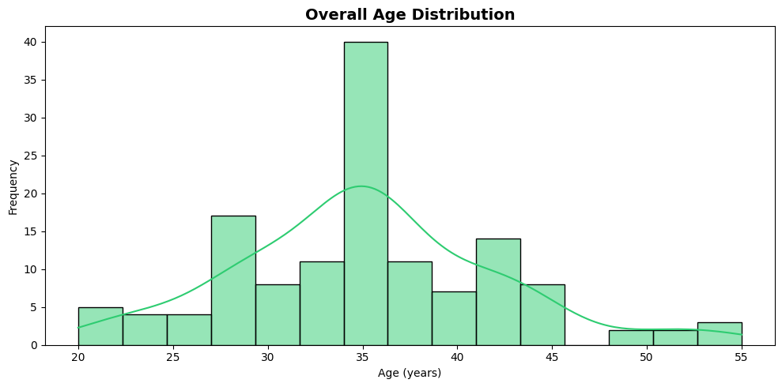
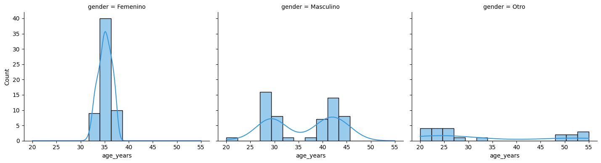

<div align="center">
    <h1>📊 Data Visualization Gallery</h1>
    <p>
        A curated collection of data visualization projects and analyses using Python.<br />
        This repository showcases <b>statistical analysis</b>, <b>exploratory data analysis (EDA)</b>,<br/>
        and <b>interactive visualizations</b> with modern libraries.
    </p>
    <br/>
    <h4>
       If you find interesting visualizations or improvements, feel free to contribute!<br/>
       <b>L E T ' S &nbsp; V I S U A L I Z E</b>
    </h4>
</div>

<br/>

## 🎯 Overview

This repository contains practical examples of data visualization techniques, from basic statistical plots to advanced interactive dashboards. Each project includes clean code, detailed analysis, and publication-ready visualizations.

---

## 🛠️ Technologies

- **Python 3.x**
- **pandas** - Data manipulation and analysis
- **seaborn** - Statistical data visualization
- **matplotlib** - Comprehensive plotting library
- **Quarto** - Reproducible scientific documents
- **numpy** - Numerical computing

---

## 📁 Projects & Visualizations

### 🔹 Histogram Analysis

<details>
  <summary><b>Age Distribution Analysis</b> - Click to view visualizations!</summary>
  <br>
  
  Statistical analysis of age demographics segmented by gender, featuring:
  - Distribution pattern identification (Gaussian, bimodal, platykurtic)
  - Faceted histograms for group comparison
  - KDE overlay for density estimation
  
  <br>
  
  **Overall Age Distribution**
  <div align="center">
    
  </div>
  
  <br>
  
  **Age Distribution by Gender**
  <div align="center">
    
  </div>
  
  <br>
  
  📂 **Location:** [`histogram/`](./histogram/)
  
</details>

### 🔹 Scatterplot Analysis

<details>
  <summary><b>Coming Soon...</b></summary>
  <br>
  
  Correlation and relationship analysis using scatter plots.
  
  <br>
  
  📂 **Location:** [`scatterplot/`](./scatterplot/)
  
</details>

---

## 🚀 Getting Started

```bash
# Clone the repository
git clone https://github.com/yourusername/data-visualization-gallery.git

# Navigate to project directory
cd data-visualization-gallery

# Install dependencies
pip install pandas seaborn matplotlib jupyter quarto numpy

# Run Quarto documents
cd histogram
quarto render analysis.qmd
```

---

## 📝 Repository Structure

```
data-visualization-gallery/
│
├── histogram/              # Histogram analysis projects
│   ├── analysis.qmd       # Quarto analysis document
│   ├── data/              # Source data
│   └── output/            # Generated reports
│
├── scatterplot/           # Scatterplot analysis projects
│
├── images/                # Preview images for README
│   ├── histogram.png
│   └── histogram_by_gender.png
│
└── resources/             # Shared resources and utilities
```

---

## 💡 Usage

Each analysis is self-contained with:
- ✅ Source data (CSV format)
- ✅ Quarto markdown (.qmd) files
- ✅ Generated HTML reports
- ✅ Python code with clear documentation
- ✅ Preview images

---

## 🤝 Contributing

Contributions are welcome! To contribute:

1. Fork the repository
2. Create a new branch (`git checkout -b feature/amazing-viz`)
3. Commit your changes (`git commit -m 'Add amazing visualization'`)
4. Push to the branch (`git push origin feature/amazing-viz`)
5. Open a Pull Request

---

## 📄 License

MIT License - feel free to use these examples for learning and projects.

---

## 📧 Contact

**Fabricio Lennart**  
Questions or suggestions? Open an issue or reach out!

---

<div align="center">
  <i>Building better data stories, one visualization at a time.</i>
</div>
